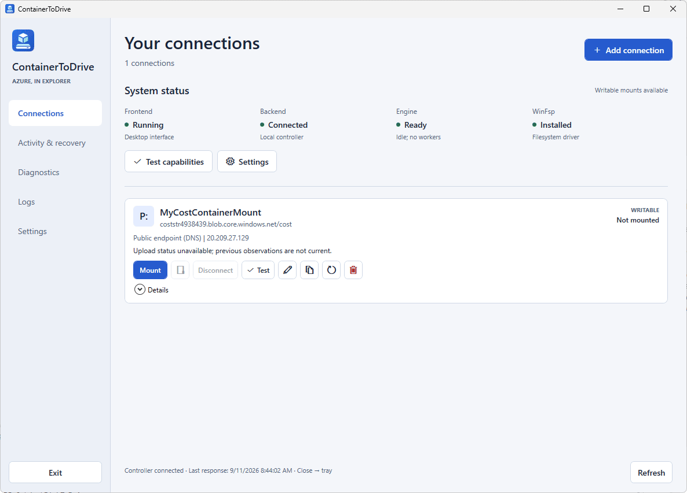

# ContainerToDrive - Mount Azure Storage Containers as Drives in Windows

**Access Azure Blob Storage through a Windows drive, with a desktop interface for the connection's entire lifecycle.**

ContainerToDrive connects an existing blob container to File Explorer using **rclone** and **WinFsp**. Choose your authentication method, test access, select a drive letter, and manage the connection from a native Windows application. Upload status, credential renewal, cache settings, and recovery stay close to the drive they belong to.

**Windows 11 x64** | **C# / .NET 10 LTS / WPF** | **0.3.1 developer preview** | **MIT-licensed application code**

[Get started](#start-here) | [Watch the walkthrough](#walkthrough) | [Explore features](#features) | [Choose authentication](#authentication) | [Read the user guide](docs/QUICKSTART.md) | [Contribute](CONTRIBUTING.md) | [Report a vulnerability](SECURITY.md)

> [!IMPORTANT]
> This is a **source-only developer preview**, not a production-supported release. No downloadable application binary or certified installer is provided by this repository. New connections begin read-only; enabling writes requires explicit confirmation. Live write durability, recovery, and installer certification remain incomplete. Evaluate with disposable data, not your only copy.

## Walkthrough

Two-minute desktop walkthrough (original GIF, approximately 2.5 MB):



[Open the walkthrough GIF at full size](docs/assets/ContainerToDrive-Walkthrough.gif).

This is the original recording of an earlier developer preview, not a synthetic-data demonstration. It retains the recorded connection and environment details. The recording predates the responsive two-column connection layout, so some screens differ from the current source. The writable mount shown does not establish write durability or production readiness.

## Why ContainerToDrive

Sometimes the task is simply to find an exported report, inspect a set of files, or copy an object out of a container. A drive letter can make those tasks convenient for people already working in Explorer, without moving the storage into a different service.

ContainerToDrive puts a desktop management layer around that workflow:

- **Keep the existing storage target.** Connect to an Azure Blob container without deploying a gateway or creating a new hosted service.
- **Make connections repeatable.** Save the target, authentication method, drive letter, and cache preferences instead of rebuilding a mount command each time.
- **Keep operational state visible.** See whether the controller is reachable, a drive is mounted, observations are stale, or recovery needs attention.
- **Separate the window from the mount.** A per-user controller owns the workers, so closing the desktop to the tray does not disconnect a drive.

The drive is a view over object storage, **not a conversion to NTFS or SMB**. Explorer familiarity does not imply local-disk semantics or compatibility with every Windows application.

## Contents

- [Walkthrough](#walkthrough)
- [Features](#features)
- [A connection from start to finish](#connection-workflow)
- [Start here](#start-here)
- [Build and test](#build-and-test)
- [Get started with GitHub Copilot Chat](#get-started-with-github-copilot-chat)
- [Try the desktop](#try-the-desktop)
- [Authentication](#authentication)
- [How it works](#how-it-works)
- [Security and local data](#security-and-local-data)
- [Important limitations](#important-limitations)
- [Common questions](#common-questions)
- [Documentation](#documentation)
- [Contributing and security](#contributing-and-security)
- [License and acknowledgments](#license)

## Features

### Connections and access

| Capability | What you can do |
| --- | --- |
| Three authentication methods | Use a container SAS, an advanced storage account key, or Microsoft Entra sign-in. |
| Searchable Azure discovery | Find subscriptions, optionally filter by resource group, and select a storage account and container. Dependent lists reset when their scope changes. |
| Saved connection profiles | Keep a name, drive letter, access mode, cache settings, and optional automatic mounting for each connection. |
| Connection actions | Mount, open in Explorer, disconnect, test saved access, edit, clone, renew credentials, or remove a connection when its state permits. |
| Responsive overview | Scan two connection cards per row in wide windows, with a one-column layout at narrower sizes. Expand Details for authentication, DNS, cache, and observation metadata. |

### Activity and recovery

| Capability | What you can inspect |
| --- | --- |
| Upload observations | Reported queue state and recovery warnings, with explicit unavailable or stale states when current evidence is missing. |
| Transfer history | Local lifetime counters and period views for Today, 7 days, 30 days, 90 days, or 1 year; filter by connection or view all connections. |
| Charts and numeric data | Transfer history, connection traffic shares, and an expandable data table. Missing intervals are not invented as zero traffic. |
| Endpoint information | DNS-resolved addresses with inferred private, public, mixed, reserved, or unavailable classifications. This is not verification of the active network route. |
| Diagnostics and logs | Review session events and explicitly create a local diagnostic export. Review exports for sensitive metadata before sharing. |

### Desktop and local settings

| Capability | How it behaves |
| --- | --- |
| Tray integration | Hide the interface while drives remain managed by the controller; return through the tray or use the explicit exit workflow. |
| Optional Windows startup | Start the interface in the tray at sign-in. Automatic mounting is a separate opt-in setting on each connection. |
| Cache preferences | Set defaults for new connections and configure existing connections separately. Changing defaults does not rewrite saved profiles. |
| Data-folder relocation | When every connection is confirmed idle, copy and verify application data to a separate local NTFS folder; preserve the original as a backup. |
| Dependency checks | Inspect local readiness and run capability checks. Explicit dependency setup uses pinned downloads and the official WinFsp installer. |

See the [user guide](docs/QUICKSTART.md) for the controls, defaults, and safety conditions behind each feature.

## Connection Workflow

1. **Add a connection.** Choose SAS URL, Account key, or Sign in to Azure. Supply credentials only through the application, not a shell command or issue report.
2. **Choose the target.** Confirm the credential-free endpoint and container, give the connection a name, and choose an available drive letter. Keep **Read-only** selected for the first evaluation.
3. **Test and save.** Validate access before mounting. A successful listing establishes listing access, not write permission or durability.
4. **Mount and browse.** Mount the saved connection, then open Explorer once the application reports the drive present.
5. **Observe.** Use the connection card for current state and **Activity & recovery** for transfer history and recovery information. Unknown or stale is not the same as idle.
6. **Disconnect deliberately.** Close files using the drive and disconnect through the application. If the result is uncertain, retain the cache and follow the recovery workflow.

> [!WARNING]
> Writable connections can change or delete Azure data. A local save may return before its upload completes, and an empty reported upload queue does not account for every open file's unsent changes.

## Start Here

| Your goal | Follow this path | Azure or driver access needed? |
| --- | --- | --- |
| Inspect the code or contribute | [Build and test](#build-and-test) | No Azure credentials or filesystem driver required. Restore uses NuGet. |
| Get guided setup help in your editor | [GitHub Copilot Chat](#get-started-with-github-copilot-chat) | Copilot access is needed for chat; Azure credentials and driver installation are not needed for build/unit checks. |
| Evaluate the desktop and mount a test container | [Try the desktop](#try-the-desktop), then the [user guide](docs/QUICKSTART.md) | Mounting requires WinFsp and access to the chosen Azure container. |
| Understand the design and data boundaries | [How it works](#how-it-works) and [Security and local data](#security-and-local-data) | No application launch required. |

### Requirements

| Requirement | Purpose |
| --- | --- |
| Windows 11 x64 | Target environment for the native desktop and mount workflow. |
| PowerShell 7.4 or newer | Runs the repository build, test, bootstrap, and packaging scripts. Windows PowerShell 5.1 is not supported by those scripts. |
| .NET 10 SDK selected by [global.json](global.json) | Required to build from source; install it separately. The local package workflow produces self-contained application runtimes. |
| rclone 1.75.1 | Transfer and VFS engine, obtained through the pinned bootstrap workflow. Not needed for the unit-test tier. |
| Official WinFsp 2.1.25156 | Filesystem prerequisite for mounting. Installed separately through its normal Windows installer. |
| Azure container access | Required only for resource discovery and cloud operations, with permissions appropriate to the authentication method and access mode. |

Use a **normal, non-administrator Windows session** for the application. WinFsp's official installer may request elevation; the desktop and mount controller should not run elevated. No Docker, WSL, Node.js, database server, or custom kernel driver is required.

## Build and Test

Clone the source and run the repeatable Release checks from PowerShell:

```powershell
git clone https://github.com/zmustafa/ContainerToDrive.git
cd ContainerToDrive
./scripts/Build.ps1 -Configuration Release -Locked
./scripts/Test.ps1 -Configuration Release -Tier Unit -Locked
./tests/scripts/WorkspaceSafety.Tests.ps1
```

The build includes the desktop, controller, supporting libraries, and test projects. `-Locked` requires restore to match the included NuGet lock files; it does not prevent NuGet downloads. Builds do not install rclone or WinFsp and do not start the application.

The default unit tier uses synthetic fixtures. It does not discover credentials, contact Azure, mount drives, or install drivers. The test wrapper rejects failures, skipped cases, and zero-test runs. Local Windows integration and interactive WPF checks have separate prerequisites and entry points; see [tests/README.md](tests/README.md).

GitHub configuration is included for Windows build/unit checks, C# CodeQL analysis, and Dependabot updates. Workflow definitions are not a claim that hosted checks have already passed. They do not create binary releases, deploy the application, or use Azure credentials.

## Get Started with GitHub Copilot Chat

You can use GitHub Copilot Chat in **VS Code or Visual Studio** to understand the repository, check prerequisites, and work through the existing scripts. Copilot is optional developer tooling, not part of ContainerToDrive: the application does not require an AI subscription or model API key.

### Prepare your editor

1. Install Git, PowerShell 7.4 or newer, and the .NET SDK selected by [global.json](global.json). Use a normal, non-administrator Windows session.
2. Clone the repository using the commands in [Build and Test](#build-and-test), then open it in your editor. A fresh source checkout keeps this workflow separate from a deployment with real profiles or mounted drives.
3. Enable GitHub Copilot and sign in through the editor's GitHub account flow with an account that has Copilot access. Do not paste a GitHub token into chat. Availability and usage limits depend on your account and organization policy.

| Editor | Open and configure |
| --- | --- |
| VS Code | Open the cloned repository folder, not just an individual source file. Install Microsoft's **C# Dev Kit** extension and enable the official GitHub Copilot integration. Open the **Chat** view. |
| Visual Studio | Use a release that supports the SDK selected by [global.json](global.json), with the **.NET desktop development** workload and GitHub Copilot enabled. Open [ContainerToDrive.slnx](ContainerToDrive.slnx), then open **GitHub Copilot Chat**. |

When prompted, review the repository before trusting the workspace or approving command execution. Copilot does not replace the required SDK, PowerShell, driver, or Azure permissions.

### Start with a plan

Attach or reference [README.md](README.md), [CONTRIBUTING.md](CONTRIBUTING.md), [SECURITY.md](SECURITY.md), and [global.json](global.json) using the chat context controls. Start in **Ask** mode, where available, and use a scoped request such as:

```text
Help me get started with ContainerToDrive on Windows. Read the attached
documentation and inspect the source and build scripts as needed.
Explain the prerequisites and the steps to build and run the offline unit
tests. Plan only: do not edit files, run commands, install dependencies,
start the application, or make Git commits or pushes.
Do not read local profiles, credentials, caches, or ignored application data.
```

Review the proposed commands against this README. Check that the SDK matches the repository and that the plan uses the existing scripts rather than inventing a different setup or weakening locked restore checks.

### Run the local build checks

Execute the commands yourself in a PowerShell 7 terminal at the repository root, or switch to **Agent** mode, if available, and explicitly approve a bounded task:

```text
Check the installed .NET SDK and PowerShell versions against this repository.
If they are compatible, run these commands from the repository root:
./scripts/Build.ps1 -Configuration Release -Locked
./scripts/Test.ps1 -Configuration Release -Tier Unit -Locked
./tests/scripts/WorkspaceSafety.Tests.ps1

Use the existing scripts without changing source, configuration, or lock files.
NuGet restore downloads are allowed. If a prerequisite or check fails, stop
and explain the failure; do not install tools or change dependencies to fix it.
Do not bootstrap, package, launch the app, access Azure, install drivers,
mount drives, stop processes, delete files, commit, or push.
Report which checks actually ran, their exit status, and any test failures.
```

Review each tool or terminal approval. Do not enable blanket approvals for setup. For a failure, share only a redacted error excerpt and the relevant source file; ask for a diagnosis before authorizing a fix. The same commands can be run manually if your editor or policy does not offer Agent mode.

### Continue to the desktop

After the checks pass, follow [Try the Desktop](#try-the-desktop) as a separate, explicitly approved task. Ask Copilot to explain the bootstrap, packaging, and launch steps before running them. Dependency downloads, WinFsp installation, packaging, and live Azure access are not part of the build/unit-test approval above.

Once the app is open, add a disposable test connection through its own UI and keep it read-only. Complete Microsoft Entra sign-in in the browser, or enter the SAS/account key in the application's credential fields. Review the connection state and use the application's disconnect workflow; do not ask Copilot to kill a worker or remove a cache to resolve an uncertain mount.

> [!WARNING]
> Chat context and tool output can be sent to your configured AI service. Never attach credentials, live profile stores, cache contents, unredacted diagnostics, or screenshots with private data. Git ignore rules and written prompts are not an access-control boundary for an agent. Keep sensitive data outside the development checkout where practical, review context and approvals, and follow your organization's Copilot policy.

## Try the Desktop

After the build checks, prepare an unsigned, self-contained local preview:

```powershell
./scripts/Bootstrap.ps1
./scripts/Package.ps1 -Configuration Release -Version 0.3.1 -Locked
./scripts/Run.ps1
```

| Step | What happens |
| --- | --- |
| Bootstrap | Downloads the pinned rclone engine and required license material, checking the configured hashes. The optional `-DownloadWinFsp` switch downloads the official prerequisite MSI; it does not install it. |
| Package | Publishes the desktop and controller with separate win-x64 runtimes, includes the engine and notices, and verifies the unsigned developer ZIP. |
| Run | Verifies the published payload and starts the desktop as a standard user with an isolated workspace development profile. |

**Before packaging, disconnect and exit all ContainerToDrive processes through the application.** Packaging refuses to replace a running deployment or overwrite an existing versioned package. Do not bypass that guard or delete uncertain recovery data to make a rebuild succeed.

Keep the full published application folder together, including its controller, engine, runtime files, and manifests. Copying only the desktop executable is not a complete installation. The optional MSI authoring workflow is separate and remains uncertified; see [installer/README.md](installer/README.md).

To mount a drive, install the official WinFsp prerequisite and use a disposable test container with read-only access. **Test capabilities** checks local components without mounting or accessing Azure; **Test** on a connection checks saved cloud access. Azure operations, retrieval, and transfer can incur charges.

## Authentication

| Method | Choose it when | Important boundary |
| --- | --- | --- |
| Container SAS URL | You have a time-limited SAS for a specific container. | Use read/list permissions for read-only access. Writable mode needs the appropriate additional permissions, including create, write, and delete. Treat the entire signed URL as a secret. |
| Storage account key | Shared Key is permitted and you deliberately need the advanced key-based flow. | An account key has broad scope; selecting one container does not narrow the key's authority. Avoid it when a more narrowly scoped method meets the need. |
| Microsoft Entra | You want browser sign-in and searchable subscription, account, and container selection. | Resource discovery, blob access, and generating a user delegation key require their respective Azure permissions. Conditional Access and credential expiry still apply. |

Microsoft Entra connections use a user delegation SAS for the mount worker. Management-plane visibility does not automatically grant data-plane access. Role-assignment changes may take time to propagate; use the connection test to check effective access.

The desktop supports an approved public-client application ID through the non-secret `CONTAINERTODRIVE_AZURE_CLIENT_ID` setting. The SDK developer registration is for local evaluation only; a customer distribution requires a project-owned, publisher-reviewed registration. See [authentication guidance](docs/QUICKSTART.md#other-authentication-options).

Saving a connection does not enable automatic mounting. Credential renewal and per-connection automatic mounting are explicit actions, and recovery or unavailable credentials can prevent a mount even when automatic mounting is enabled.

## How It Works

ContainerToDrive separates the desktop control path from filesystem and transfer work:

| Component | Responsibility |
| --- | --- |
| WPF desktop | Connection forms, Azure discovery, status presentation, settings, and user-confirmed actions. |
| Per-user controller | Validates requests, manages connection state and persistence, and supervises an isolated worker for each mount. |
| rclone worker | Implements Azure transfers, directory enumeration, retries, and VFS caching for its connection. |
| WinFsp | Provides the Windows filesystem integration used to expose the mounted drive. |
| Azure Blob Storage | Remains the remote storage target. A mounted drive does not change the container into a shared filesystem. |

The desktop sends typed requests over a local named pipe; both sides verify peer identity. File access goes through WinFsp and the rclone worker, not through the desktop's UI thread. Azure sign-in and resource discovery are separate desktop operations.

The controller can continue managing drives and recording transfer observations while the window is hidden or the interface exits with drives running. **Exit interface only** and stopping the controller have different consequences; use the application's explicit exit workflow.

### Technology and source map

| Area | Implementation | Source |
| --- | --- | --- |
| Desktop | C# / .NET 10, WPF, Azure SDKs, OxyPlot | [Desktop overview](src/ContainerToDrive.Desktop/README.md) |
| Controller | Per-user .NET process and mount lifecycle management | [Controller project](src/ContainerToDrive.Controller/ContainerToDrive.Controller.csproj) |
| Shared models | Validation, wire contracts, and transfer statistics | [Core project](src/ContainerToDrive.Core/ContainerToDrive.Core.csproj) |
| Windows integration | DPAPI, ACLs, named pipes, process identity, and worker jobs | [Windows API](src/ContainerToDrive.Windows/README.md) |
| Engine adapter | Verified engine discovery and rclone worker integration | [rclone integration project](src/ContainerToDrive.Rclone/ContainerToDrive.Rclone.csproj) |
| Developer tooling | PowerShell entry points, locked NuGet restore, and xUnit | [Script reference](scripts/README.md) and [test tiers](tests/README.md) |

## Security and Local Data

- **Least privilege starts with access choice.** New connections default to read-only and automatic mounting off. Writable consent does not replace Azure authorization or provide per-file approval prompts.
- **Credentials are not command-line inputs.** Use the application's credential fields. Never paste SAS URLs, account keys, tokens, or authorization responses into public issues, shell arguments, or screenshots.
- **Sensitive settings are protected for the Windows user.** Saved credentials, preferences, and transfer history use Windows-user DPAPI protection. Application directories use restricted ACLs. These protections are not a secrecy boundary against administrator access or malware running as the same user.
- **The VFS cache is sensitive local data.** It can contain file contents and unsent changes. Protect the storage location and retain uncertain recovery state; a cache is not an independent backup or proof of remote persistence.
- **Diagnostics are shared only by your choice.** Exports are created locally and intended to be redacted, but metadata may still be sensitive. Review the actual files before attaching or uploading anything.
- **Transfer charts are observations, not billing records.** History stores numeric counters, connection identifiers, and timestamps rather than file contents. Totals can include retries and are not a directional traffic breakdown or confirmation that writes reached Azure.

The source publication excludes live profiles, credentials, caches, and generated binaries. The walkthrough is an original live recording with recorded environment details; media require separate privacy review and are not covered by text-only credential scans. Git exclusions are a repository boundary, not a substitute for reviewing material before sharing it. Read [SECURITY.md](SECURITY.md) for the security model and private reporting route.

## Important Limitations

| Area | What to account for |
| --- | --- |
| Filesystem behavior | Blob storage does not supply NTFS or SMB semantics. Flat-namespace renames are not atomic; simultaneous writers can overwrite one another. |
| Writable access | Local saves can complete before uploads. A successful mount, listing, or empty reported queue is not remote-byte verification. |
| Application compatibility | Databases, VM disks, collaborative editing, and full offline operation are outside the supported scope. Evaluate other applications individually with disposable data. |
| Visibility and networking | A DNS classification is an inference from observed addresses, not validation of Private Link or the worker's current route. Stale controller state is not evidence that a drive stopped. |
| Credentials and connectivity | Expiry, RBAC propagation, Conditional Access, and network changes can interrupt access. Reopening the interface does not automatically resolve every mount or recovery problem. |
| Release readiness | Live write/recovery validation, clean-VM installer lifecycle checks, signing, accessibility certification, and complete third-party binary-distribution review remain open gates. |

Start by browsing or copying files **out of a disposable test container in read-only mode**. Keep independent backups and do not use the preview as the sole access path to important data.

## Common Questions

### Is this a synchronization or backup application?

No. It exposes a container through a mounted drive and delegates transfer/caching behavior to rclone. It is not a backup policy, a bidirectional folder-sync product, or a full offline replica.

### Does closing the window disconnect my drives?

By default, closing the window hides it to the tray. The controller continues managing its workers. Return through the tray or use the explicit exit workflow; the behavior can be configured in Settings.

### Does cloning a connection copy its Azure data?

No. A clone points to the same target with copied connection settings and saved authentication, a new name and drive letter, and automatic mounting off. It remains unmounted and does not copy cached contents, recovery state, or remote files. A cloned connection is not a backup.

### Why can a connection test pass but a later operation fail?

A listing test checks a narrower operation at a particular time. It does not establish permission for writes, deletes, every blob, or future requests. Credentials, policies, connectivity, and the state of individual objects can also change.

### Can I remove the cache to fix an interrupted mount?

Do not delete it while the mount or its recovery state is uncertain. Close open files, inspect the current state, and use the application's recovery and disconnect controls. Cached changes may be the only remaining copy of data that has not reached Azure.

### Does this deploy anything into my Azure subscription?

The application does not require a hosted gateway or a new Azure deployment. It authenticates to existing resources for discovery and blob operations. Those operations remain subject to your permissions, network policies, and Azure charges.

## Documentation

| Looking for | Read |
| --- | --- |
| First connection, mounting, recovery, settings, and transfer statistics | [User guide](docs/QUICKSTART.md) |
| Development setup, change conventions, and review expectations | [Contributing](CONTRIBUTING.md) |
| Build, bootstrap, run, package, verify, and cleanup contracts | [PowerShell entry points](scripts/README.md) |
| Unit tests, opt-in checks, and remaining verification gates | [Test tiers](tests/README.md) |
| Synthetic Windows/controller integration tests | [Local integration checks](tests/ContainerToDrive.IntegrationTests/README.md) |
| Interactive WPF layout, control, and tray checks | [Native desktop checks](tests/desktop/README.md) |
| Portable developer packages and prerequisite handling | [Installation guidance](installer/INSTALLATION.md) |
| Optional WiX authoring and unverified installer lifecycle | [Installer authoring](installer/README.md) |
| Security boundaries and private disclosure | [Security policy](SECURITY.md) |
| Dependency licenses and binary redistribution obligations | [Third-party notices](THIRD-PARTY-NOTICES.md) |

## Contributing and Security

Issues and pull requests are welcome. Support is **best effort**, without a response-time or production-support commitment. Useful contributions include reproducible synthetic bug reports, focused tests, clearer operational guidance, accessibility improvements, and carefully scoped fixes.

Read [CONTRIBUTING.md](CONTRIBUTING.md), discuss substantial changes before implementation, and include the checks you actually ran. Keep credentials, real storage identifiers, personal paths, and unredacted logs out of reports and pull requests. Do not weaken safety guards to make a test pass.

For vulnerabilities, use the private reporting route in [SECURITY.md](SECURITY.md), not a public issue. No screenshot, successful test, or scanner result should be presented as a complete security or durability certification.

## License

Original project work is covered by the MIT [LICENSE](LICENSE). Dependencies keep their own licenses; the application's MIT license does not relicense rclone, WinFsp, the .NET runtime, or any other third-party component.

### Acknowledgments

- [rclone](https://github.com/rclone/rclone) provides the Azure transfer engine and VFS implementation.
- [WinFsp](https://github.com/winfsp/winfsp) provides Windows filesystem integration.
- [OxyPlot](https://github.com/oxyplot/oxyplot) powers the desktop transfer charts.
- [.NET](https://github.com/dotnet) and the [Azure SDK for .NET](https://github.com/Azure/azure-sdk-for-net) provide the desktop/runtime and Azure client libraries.

WinFsp is GPLv3 with an upstream FLOSS exception, **not MIT**. Source availability does not waive binary redistribution, notice, or source-availability obligations. Review [THIRD-PARTY-NOTICES.md](THIRD-PARTY-NOTICES.md) before distributing packages.

WinFsp - Windows File System Proxy, Copyright (C) Bill Zissimopoulos. [WinFsp repository](https://github.com/winfsp/winfsp).